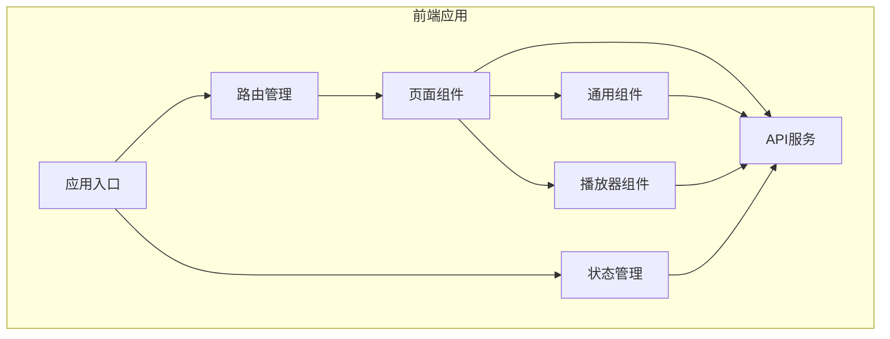

# 本地视频系统前端详细设计方案

## 1. 技术架构

### 1.1 技术栈选择

| 类别 | 技术 | 版本 | 选型理由 |
|------|------|------|----------|
| **核心框架** | Vue 3 + TypeScript | 3.x | 轻量、学习曲线平缓、生态丰富，TypeScript提供类型安全 |
| **UI组件库** | Element Plus | 2.x | 中文友好、组件丰富、文档完善，适合快速构建管理系统界面 |
| **状态管理** | Pinia | 2.x | Vue 3官方推荐，轻量、易于使用，支持TypeScript |
| **路由** | Vue Router | 4.x | Vue官方路由库，与Vue 3完美集成 |
| **网络请求** | Axios | 1.x | 功能强大的HTTP客户端，支持拦截器、请求/响应转换等 |
| **样式** | SCSS + Element Plus主题 | - | SCSS提供更强大的样式编写能力，Element Plus主题支持定制 |
| **构建工具** | Vite | 4.x | 快速的开发服务器和构建工具，支持热更新 |
| **播放器** | DPlayer | 1.x | 开源、功能丰富、支持多种格式，适合流媒体播放 |

### 1.2 架构设计

采用**组件化、模块化**的前端架构，遵循Vue 3的Composition API风格，实现高内聚、低耦合的代码结构。



## 2. 项目结构

### 2.1 目录结构

```
frontend/
├── public/                 # 静态资源
│   ├── favicon.ico         # 网站图标
│   └── assets/             # 静态资源文件
├── src/                    # 源代码
│   ├── components/         # 通用组件
│   │   ├── common/         # 基础通用组件
│   │   ├── layout/         # 布局组件
│   │   └── media/          # 媒体相关组件
│   ├── views/              # 页面组件
│   │   ├── home/           # 首页
│   │   ├── library/        # 媒体库
│   │   ├── detail/         # 详情页
│   │   ├── player/         # 播放页
│   │   └── settings/       # 设置页
│   ├── services/           # API服务
│   │   ├── api.ts          # API配置
│   │   ├── media.ts        # 媒体相关API
│   │   ├── settings.ts     # 设置相关API
│   │   └── ws.ts           # WebSocket服务
│   ├── store/              # 状态管理
│   │   ├── modules/        # 模块状态
│   │   └── index.ts        # 状态管理入口
│   ├── router/             # 路由
│   │   ├── routes.ts       # 路由配置
│   │   └── index.ts        # 路由入口
│   ├── utils/              # 工具函数
│   │   ├── format.ts       # 格式化工具
│   │   └── storage.ts      # 存储工具
│   ├── styles/             # 样式文件
│   │   ├── variables.scss  # 变量定义
│   │   ├── mixins.scss     # 混合器
│   │   └── global.scss     # 全局样式
│   ├── types/              # TypeScript类型定义
│   │   ├── media.ts        # 媒体相关类型
│   │   └── api.ts          # API相关类型
│   ├── App.vue             # 应用根组件
│   └── main.ts             # 应用入口
├── .eslintrc.js            # ESLint配置
├── .prettierrc             # Prettier配置
├── tsconfig.json           # TypeScript配置
├── vite.config.ts          # Vite配置
└── package.json            # 项目依赖
```

### 2.2 文件说明

| 文件/目录 | 描述 | 职责 |
|-----------|------|------|
| public/ | 静态资源目录 | 存放不需要打包的静态文件 |
| src/components/ | 通用组件目录 | 存放可复用的组件 |
| src/views/ | 页面组件目录 | 存放页面级组件 |
| src/services/ | API服务目录 | 封装与后端的通信逻辑 |
| src/store/ | 状态管理目录 | 管理应用状态 |
| src/router/ | 路由目录 | 配置应用路由 |
| src/utils/ | 工具函数目录 | 存放通用工具函数 |
| src/styles/ | 样式文件目录 | 存放全局样式和样式变量 |
| src/types/ | 类型定义目录 | 存放TypeScript类型定义 |

## 3. 页面设计

### 3.1 首页

**功能**：媒体推荐、最近添加、分类导航

**组件结构**：
- `HomeView.vue`：首页容器
- `Carousel.vue`：轮播图组件，展示推荐媒体
- `MediaCard.vue`：媒体卡片组件，展示媒体信息
- `CategoryNav.vue`：分类导航组件，提供分类筛选
- `RecentMedia.vue`：最近添加媒体组件

**页面布局**：
```
┌─────────────────────────────────────────────────────┐
│                     导航栏                          │
├─────────────────────────────────────────────────────┤
│                     轮播图                          │
├─────────────────────────────────────────────────────┤
│                 分类导航栏                          │
├─────────────────────────────────────────────────────┤
│  ┌───────────────┐  ┌───────────────┐  ┌───────────┐ │
│  │               │  │               │  │           │ │
│  │  最近添加     │  │  推荐电影     │  │  推荐剧集 │ │
│  │               │  │               │  │           │ │
│  └───────────────┘  └───────────────┘  └───────────┘ │
├─────────────────────────────────────────────────────┤
│                     页脚                            │
└─────────────────────────────────────────────────────┘
```

### 3.2 媒体库

**功能**：媒体列表、筛选、排序

**组件结构**：
- `LibraryView.vue`：媒体库容器
- `MediaGrid.vue`：媒体网格组件，展示媒体列表
- `FilterBar.vue`：筛选栏组件，提供类型、年份等筛选
- `SortOptions.vue`：排序选项组件，提供排序方式选择
- `Pagination.vue`：分页组件，处理分页逻辑

**页面布局**：
```
┌─────────────────────────────────────────────────────┐
│                     导航栏                          │
├─────────────────────────────────────────────────────┤
│  ┌─────────────────────┐  ┌──────────────────────┐ │
│  │                     │  │                      │ │
│  │   筛选条件          │  │    排序选项          │ │
│  │                     │  │                      │ │
│  └─────────────────────┘  └──────────────────────┘ │
├─────────────────────────────────────────────────────┤
│  ┌────────┐  ┌────────┐  ┌────────┐  ┌────────┐    │
│  │        │  │        │  │        │  │        │    │
│  │  媒体  │  │  媒体  │  │  媒体  │  │  媒体  │    │
│  │  卡片  │  │  卡片  │  │  卡片  │  │  卡片  │    │
│  └────────┘  └────────┘  └────────┘  └────────┘    │
│  ┌────────┐  ┌────────┐  ┌────────┐  ┌────────┐    │
│  │        │  │        │  │        │  │        │    │
│  │  媒体  │  │  媒体  │  │  媒体  │  │  媒体  │    │
│  │  卡片  │  │  卡片  │  │  卡片  │  │  卡片  │    │
│  └────────┘  └────────┘  └────────┘  └────────┘    │
├─────────────────────────────────────────────────────┤
│                     分页                            │
├─────────────────────────────────────────────────────┤
│                     页脚                            │
└─────────────────────────────────────────────────────┘
```

### 3.3 详情页

**功能**：媒体信息、播放按钮、相关推荐

**组件结构**：
- `DetailView.vue`：详情页容器
- `InfoPanel.vue`：信息面板组件，展示媒体详细信息
- `PlayButton.vue`：播放按钮组件
- `RelatedMedia.vue`：相关推荐组件，展示相关媒体
- `SeasonEpisode.vue`：剧集季集组件（仅电视剧）

**页面布局**：
```
┌─────────────────────────────────────────────────────┐
│                     导航栏                          │
├─────────────────────────────────────────────────────┤
│  ┌─────────────────────────────────────────────────┐ │
│  │                     背景图                      │ │
│  └─────────────────────────────────────────────────┘ │
├─────────────────────────────────────────────────────┤
│  ┌─────────────┐  ┌──────────────────────────────┐ │
│  │             │  │                              │ │
│  │   海报图    │  │    媒体信息                  │ │
│  │             │  │    - 标题                    │ │
│  │             │  │    - 年份                    │ │
│  │             │  │    - 评分                    │ │
│  │             │  │    - 简介                    │ │
│  │             │  │    - 播放按钮                │ │
│  └─────────────┘  └──────────────────────────────┘ │
├─────────────────────────────────────────────────────┤
│  ┌─────────────────────────────────────────────────┐ │
│  │                季集列表（电视剧）               │ │
│  └─────────────────────────────────────────────────┘ │
├─────────────────────────────────────────────────────┤
│  ┌─────────────────────────────────────────────────┐ │
│  │                  相关推荐                      │ │
│  └─────────────────────────────────────────────────┘ │
├─────────────────────────────────────────────────────┤
│                     页脚                            │
└─────────────────────────────────────────────────────┘
```

### 3.4 播放页

**功能**：视频播放器、字幕选择、播放控制

**组件结构**：
- `PlayerView.vue`：播放页容器
- `DPlayer`：第三方播放器组件
- `SubtitleSelector.vue`：字幕选择组件
- `PlaybackControls.vue`：播放控制组件
- `QualitySelector.vue`：画质选择组件

**页面布局**：
```
┌─────────────────────────────────────────────────────┐
│                     导航栏                          │
├─────────────────────────────────────────────────────┤
│  ┌─────────────────────────────────────────────────┐ │
│  │                                                 │ │
│  │                 视频播放器                      │ │
│  │                                                 │ │
│  └─────────────────────────────────────────────────┘ │
├─────────────────────────────────────────────────────┤
│  ┌───────────────┐  ┌───────────────┐  ┌───────────┐ │
│  │               │  │               │  │           │ │
│  │  字幕选择     │  │  画质选择     │  │  播放控制 │ │
│  │               │  │               │  │           │ │
│  └───────────────┘  └───────────────┘  └───────────┘ │
├─────────────────────────────────────────────────────┤
│  ┌─────────────────────────────────────────────────┐ │
│  │                  剧集列表（电视剧）             │ │
│  └─────────────────────────────────────────────────┘ │
├─────────────────────────────────────────────────────┤
│                     页脚                            │
└─────────────────────────────────────────────────────┘
```

### 3.5 设置页

**功能**：媒体库配置、刮削器设置、系统信息

**组件结构**：
- `SettingsView.vue`：设置页容器
- `SettingsPanel.vue`：设置面板组件
- `LibraryConfig.vue`：媒体库配置组件
- `ScraperConfig.vue`：刮削器配置组件
- `SystemInfo.vue`：系统信息组件

**页面布局**：
```
┌─────────────────────────────────────────────────────┐
│                     导航栏                          │
├─────────────────────────────────────────────────────┤
│  ┌───────────────┐  ┌────────────────────────────┐ │
│  │               │  │                            │ │
│  │   设置导航    │  │    设置内容                │ │
│  │               │  │                            │ │
│  │   - 媒体库    │  │                            │ │
│  │   - 刮削器    │  │                            │ │
│  │   - 系统信息  │  │                            │ │
│  │               │  │                            │ │
│  └───────────────┘  └────────────────────────────┘ │
├─────────────────────────────────────────────────────┤
│                     页脚                            │
└─────────────────────────────────────────────────────┘
```

## 4. 组件设计

### 4.1 通用组件

#### 4.1.1 MediaCard 组件

**功能**：展示媒体卡片，包含海报、标题、评分等信息

**Props**：
- `media`：媒体对象，包含id、title、poster_path、rating等属性
- `type`：媒体类型，如'movie'、'tv'等
- `showRating`：是否显示评分，默认true

**Events**：
- `click`：点击卡片时触发，传递媒体id

**示例**：
```vue
<MediaCard 
  :media="media" 
  :type="media.type" 
  @click="handleMediaClick(media.id)"
/>
```

#### 4.1.2 Carousel 组件

**功能**：轮播展示推荐媒体

**Props**：
- `items`：轮播项数组，每个项包含id、title、backdrop_path等属性
- `interval`：轮播间隔，默认5000ms
- `autoplay`：是否自动播放，默认true

**Events**：
- `click`：点击轮播项时触发，传递媒体id

**示例**：
```vue
<Carousel 
  :items="recommendedMedia" 
  @click="handleMediaClick"
/>
```

#### 4.1.3 FilterBar 组件

**功能**：提供媒体筛选功能

**Props**：
- `filters`：筛选条件对象，包含type、year、genre等
- `availableFilters`：可用的筛选选项

**Events**：
- `filterChange`：筛选条件变化时触发，传递新的筛选条件

**示例**：
```vue
<FilterBar 
  :filters="currentFilters" 
  :availableFilters="availableFilters"
  @filterChange="handleFilterChange"
/>
```

### 4.2 页面组件

#### 4.2.1 HomeView 组件

**功能**：首页，展示推荐媒体、最近添加和分类导航

**核心逻辑**：
- 加载推荐媒体
- 加载最近添加的媒体
- 提供分类导航
- 响应式布局适配不同设备

**API调用**：
- `/api/media`：获取推荐媒体
- `/api/history`：获取最近观看的媒体

#### 4.2.2 LibraryView 组件

**功能**：媒体库页面，展示媒体列表、筛选和排序

**核心逻辑**：
- 加载媒体列表
- 处理筛选逻辑
- 处理排序逻辑
- 处理分页逻辑

**API调用**：
- `/api/media`：获取媒体列表，支持筛选和排序参数

#### 4.2.3 DetailView 组件

**功能**：媒体详情页，展示媒体详细信息、播放按钮和相关推荐

**核心逻辑**：
- 加载媒体详情
- 加载相关推荐
- 处理播放逻辑
- 处理收藏逻辑

**API调用**：
- `/api/media/:id`：获取媒体详情
- `/api/media/:id/subtitles`：获取字幕列表
- `/api/favorites`：获取收藏状态和添加/删除收藏

#### 4.2.4 PlayerView 组件

**功能**：播放页面，集成播放器、字幕选择和播放控制

**核心逻辑**：
- 初始化播放器
- 加载播放地址
- 处理字幕选择
- 处理播放控制
- 记录观看历史

**API调用**：
- `/api/media/:id/play`：获取播放地址
- `/api/media/:id/subtitles`：获取字幕列表
- `/api/history`：记录观看历史

#### 4.2.5 SettingsView 组件

**功能**：设置页面，配置媒体库、刮削器和查看系统信息

**核心逻辑**：
- 加载系统设置
- 处理设置更新
- 触发媒体扫描
- 展示系统信息

**API调用**：
- `/api/settings`：获取和更新系统设置
- `/api/scan`：触发媒体扫描
- `/api/folders`：获取文件夹列表

## 5. 状态管理

### 5.1 状态模块设计

使用Pinia进行状态管理，将状态分为以下模块：

#### 5.1.1 Media模块

**功能**：管理媒体相关状态

**状态**：
- `mediaList`：媒体列表
- `currentMedia`：当前媒体详情
- `loading`：加载状态
- `error`：错误信息

**Actions**：
- `fetchMediaList`：获取媒体列表
- `fetchMediaDetail`：获取媒体详情
- `searchMedia`：搜索媒体

#### 5.1.2 History模块

**功能**：管理观看历史

**状态**：
- `historyList`：观看历史列表
- `loading`：加载状态

**Actions**：
- `fetchHistory`：获取观看历史
- `addHistory`：添加观看历史

#### 5.1.3 Favorites模块

**功能**：管理收藏

**状态**：
- `favoritesList`：收藏列表
- `loading`：加载状态

**Actions**：
- `fetchFavorites`：获取收藏列表
- `toggleFavorite`：添加/删除收藏

#### 5.1.4 Settings模块

**功能**：管理系统设置

**状态**：
- `settings`：系统设置
- `loading`：加载状态

**Actions**：
- `fetchSettings`：获取系统设置
- `updateSettings`：更新系统设置

#### 5.1.5 UI模块

**功能**：管理UI相关状态

**状态**：
- `sidebarCollapsed`：侧边栏折叠状态
- `currentTheme`：当前主题
- `isMobile`：是否为移动设备

**Actions**：
- `toggleSidebar`：切换侧边栏状态
- `setTheme`：设置主题

### 5.2 状态管理示例

```typescript
// store/modules/media.ts
import { defineStore } from 'pinia';
import { mediaAPI } from '@/services/media';
import type { Media, MediaListParams } from '@/types/media';

export const useMediaStore = defineStore('media', {
  state: () => ({
    mediaList: [] as Media[],
    currentMedia: null as Media | null,
    loading: false,
    error: null as string | null,
  }),
  
  actions: {
    async fetchMediaList(params?: MediaListParams) {
      this.loading = true;
      this.error = null;
      try {
        const response = await mediaAPI.getMediaList(params);
        this.mediaList = response.data;
      } catch (error) {
        this.error = 'Failed to fetch media list';
        console.error(error);
      } finally {
        this.loading = false;
      }
    },
    
    async fetchMediaDetail(id: number) {
      this.loading = true;
      this.error = null;
      try {
        const response = await mediaAPI.getMediaDetail(id);
        this.currentMedia = response.data;
      } catch (error) {
        this.error = 'Failed to fetch media detail';
        console.error(error);
      } finally {
        this.loading = false;
      }
    },
  },
});
```

## 6. API服务

### 6.1 API配置

```typescript
// services/api.ts
import axios from 'axios';

const apiClient = axios.create({
  baseURL: '/api',
  timeout: 10000,
  headers: {
    'Content-Type': 'application/json',
  },
});

// 请求拦截器
apiClient.interceptors.request.use(
  (config) => {
    // 可以在这里添加认证信息等
    return config;
  },
  (error) => {
    return Promise.reject(error);
  }
);

// 响应拦截器
apiClient.interceptors.response.use(
  (response) => {
    return response;
  },
  (error) => {
    // 统一处理错误
    console.error('API Error:', error);
    return Promise.reject(error);
  }
);

export default apiClient;
```

### 6.2 媒体API服务

```typescript
// services/media.ts
import apiClient from './api';
import type { Media, MediaListParams, Episode, WatchHistory, Favorite } from '@/types/media';

export const mediaAPI = {
  // 获取媒体列表
  getMediaList(params?: MediaListParams) {
    return apiClient.get<Media[]>('/media', { params });
  },
  
  // 获取媒体详情
  getMediaDetail(id: number) {
    return apiClient.get<Media>(`/media/${id}`);
  },
  
  // 获取播放地址
  getPlayUrl(id: number) {
    return apiClient.get<{ url: string }>(`/media/${id}/play`);
  },
  
  // 获取字幕列表
  getSubtitles(id: number) {
    return apiClient.get<{ id: number; name: string; url: string }[]>(`/media/${id}/subtitles`);
  },
  
  // 获取文件夹列表
  getFolders() {
    return apiClient.get<{ id: number; name: string; path: string }[]>('/folders');
  },
  
  // 触发媒体扫描
  triggerScan() {
    return apiClient.post('/scan');
  },
  
  // 获取观看历史
  getHistory() {
    return apiClient.get<WatchHistory[]>('/history');
  },
  
  // 记录观看历史
  addHistory(data: { media_id: number; episode_id?: number; progress: number; completed: boolean }) {
    return apiClient.post('/history', data);
  },
  
  // 获取收藏列表
  getFavorites() {
    return apiClient.get<Favorite[]>('/favorites');
  },
  
  // 添加/删除收藏
  toggleFavorite(mediaId: number) {
    return apiClient.post('/favorites', { media_id: mediaId });
  },
};
```

### 6.3 设置API服务

```typescript
// services/settings.ts
import apiClient from './api';

export const settingsAPI = {
  // 获取系统设置
  getSettings() {
    return apiClient.get<{ key: string; value: string }[]>('/settings');
  },
  
  // 更新系统设置
  updateSettings(settings: { key: string; value: string }[]) {
    return apiClient.put('/settings', settings);
  },
};
```

### 6.4 WebSocket服务

```typescript
// services/ws.ts
class WebSocketService {
  private ws: WebSocket | null = null;
  private listeners: Map<string, Function[]> = new Map();
  
  connect() {
    if (this.ws) {
      return;
    }
    
    this.ws = new WebSocket('ws://localhost:8080/api/ws');
    
    this.ws.onopen = () => {
      console.log('WebSocket connected');
    };
    
    this.ws.onmessage = (event) => {
      try {
        const message = JSON.parse(event.data);
        const { type, data } = message;
        
        if (this.listeners.has(type)) {
          const callbacks = this.listeners.get(type);
          callbacks?.forEach(callback => callback(data));
        }
      } catch (error) {
        console.error('Error parsing WebSocket message:', error);
      }
    };
    
    this.ws.onclose = () => {
      console.log('WebSocket disconnected');
      this.ws = null;
      // 尝试重连
      setTimeout(() => this.connect(), 5000);
    };
    
    this.ws.onerror = (error) => {
      console.error('WebSocket error:', error);
    };
  }
  
  on(type: string, callback: Function) {
    if (!this.listeners.has(type)) {
      this.listeners.set(type, []);
    }
    this.listeners.get(type)?.push(callback);
  }
  
  off(type: string, callback: Function) {
    if (this.listeners.has(type)) {
      const callbacks = this.listeners.get(type);
      if (callbacks) {
        this.listeners.set(type, callbacks.filter(cb => cb !== callback));
      }
    }
  }
  
  disconnect() {
    if (this.ws) {
      this.ws.close();
      this.ws = null;
    }
    this.listeners.clear();
  }
}

export const wsService = new WebSocketService();
```

## 7. 路由设计

### 7.1 路由配置

```typescript
// router/routes.ts
import type { RouteRecordRaw } from 'vue-router';

const routes: RouteRecordRaw[] = [
  {
    path: '/',
    name: 'Home',
    component: () => import('@/views/home/HomeView.vue'),
    meta: { title: '首页' },
  },
  {
    path: '/library',
    name: 'Library',
    component: () => import('@/views/library/LibraryView.vue'),
    meta: { title: '媒体库' },
  },
  {
    path: '/detail/:id',
    name: 'Detail',
    component: () => import('@/views/detail/DetailView.vue'),
    props: true,
    meta: { title: '媒体详情' },
  },
  {
    path: '/player/:id',
    name: 'Player',
    component: () => import('@/views/player/PlayerView.vue'),
    props: true,
    meta: { title: '播放' },
  },
  {
    path: '/settings',
    name: 'Settings',
    component: () => import('@/views/settings/SettingsView.vue'),
    meta: { title: '设置' },
  },
  {
    path: '/:pathMatch(.*)*',
    name: 'NotFound',
    component: () => import('@/views/NotFound.vue'),
    meta: { title: '页面不存在' },
  },
];

export default routes;
```

### 7.2 路由守卫

```typescript
// router/index.ts
import { createRouter, createWebHistory } from 'vue-router';
import routes from './routes';

const router = createRouter({
  history: createWebHistory(),
  routes,
  scrollBehavior(to, from, savedPosition) {
    if (savedPosition) {
      return savedPosition;
    } else {
      return { top: 0 };
    }
  },
});

// 全局前置守卫
router.beforeEach((to, from, next) => {
  // 设置页面标题
  document.title = `${to.meta.title || '本地视频系统'} - Local Media System`;
  next();
});

export default router;
```

## 8. 样式设计

### 8.1 全局样式

```scss
// styles/global.scss
@import './variables.scss';
@import './mixins.scss';

// 全局重置
* {
  margin: 0;
  padding: 0;
  box-sizing: border-box;
}

body {
  font-family: 'Helvetica Neue', Helvetica, 'PingFang SC', 'Hiragino Sans GB', 'Microsoft YaHei', Arial, sans-serif;
  font-size: 14px;
  line-height: 1.5;
  color: $text-color;
  background-color: $bg-color;
}

// 通用样式
.container {
  width: 100%;
  max-width: 1200px;
  margin: 0 auto;
  padding: 0 20px;
}

// 媒体卡片样式
.media-card {
  transition: all 0.3s ease;
  
  &:hover {
    transform: translateY(-5px);
    box-shadow: 0 10px 20px rgba(0, 0, 0, 0.1);
  }
}

// 按钮样式
.btn {
  @include button-base;
  
  &.btn-primary {
    @include button-variant($primary-color, $primary-hover-color);
  }
  
  &.btn-success {
    @include button-variant($success-color, $success-hover-color);
  }
  
  &.btn-danger {
    @include button-variant($danger-color, $danger-hover-color);
  }
}

// 响应式断点
@media (max-width: 768px) {
  .container {
    padding: 0 10px;
  }
}
```

### 8.2 变量定义

```scss
// styles/variables.scss
// 颜色变量
$primary-color: #409EFF;
$primary-hover-color: #66B1FF;
$success-color: #67C23A;
$success-hover-color: #85CE61;
$danger-color: #F56C6C;
$danger-hover-color: #F78989;
$warning-color: #E6A23C;
$warning-hover-color: #EEB560;
$info-color: #909399;
$info-hover-color: #A6A9AD;

// 文本颜色
$text-color: #303133;
$text-color-secondary: #606266;
$text-color-light: #909399;
$text-color-placeholder: #C0C4CC;

// 背景颜色
$bg-color: #F5F7FA;
$bg-color-light: #FFFFFF;
$bg-color-dark: #E4E7ED;

// 边框颜色
$border-color: #DCDFE6;
$border-color-light: #E4E7ED;
$border-color-dark: #C0C4CC;

// 字体大小
$font-size-xs: 12px;
$font-size-sm: 14px;
$font-size-base: 16px;
$font-size-lg: 18px;
$font-size-xl: 20px;
$font-size-xxl: 24px;

// 间距
$spacing-xs: 4px;
$spacing-sm: 8px;
$spacing-md: 16px;
$spacing-lg: 24px;
$spacing-xl: 32px;
$spacing-xxl: 48px;

// 圆角
$border-radius-sm: 2px;
$border-radius-md: 4px;
$border-radius-lg: 8px;
$border-radius-xl: 12px;

// 阴影
$shadow-sm: 0 2px 4px rgba(0, 0, 0, 0.05);
$shadow-md: 0 4px 12px rgba(0, 0, 0, 0.1);
$shadow-lg: 0 8px 24px rgba(0, 0, 0, 0.15);
```

### 8.3 混合器

```scss
// styles/mixins.scss
// 按钮基础样式
@mixin button-base {
  display: inline-block;
  padding: 8px 16px;
  font-size: $font-size-sm;
  font-weight: 500;
  line-height: 1.5;
  text-align: center;
  white-space: nowrap;
  vertical-align: middle;
  cursor: pointer;
  border: 1px solid transparent;
  border-radius: $border-radius-md;
  transition: all 0.3s ease;
  outline: none;
  
  &:disabled {
    cursor: not-allowed;
    opacity: 0.6;
  }
}

// 按钮变体
@mixin button-variant($color, $hover-color) {
  color: #FFFFFF;
  background-color: $color;
  border-color: $color;
  
  &:hover {
    background-color: $hover-color;
    border-color: $hover-color;
  }
  
  &:active {
    background-color: darken($color, 10%);
    border-color: darken($color, 10%);
  }
}

// 卡片样式
@mixin card {
  background-color: $bg-color-light;
  border-radius: $border-radius-lg;
  box-shadow: $shadow-sm;
  padding: $spacing-lg;
  transition: all 0.3s ease;
  
  &:hover {
    box-shadow: $shadow-md;
  }
}

// 响应式工具
@mixin responsive($breakpoint) {
  @if $breakpoint == 'sm' {
    @media (max-width: 576px) {
      @content;
    }
  } @else if $breakpoint == 'md' {
    @media (max-width: 768px) {
      @content;
    }
  } @else if $breakpoint == 'lg' {
    @media (max-width: 992px) {
      @content;
    }
  } @else if $breakpoint == 'xl' {
    @media (max-width: 1200px) {
      @content;
    }
  }
}
```

## 9. 响应式设计

### 9.1 设计原则

- **移动优先**：优先考虑移动设备的用户体验
- **断点设计**：根据不同设备尺寸设置合理的断点
- **弹性布局**：使用Flexbox和Grid实现灵活的布局
- **内容适配**：根据屏幕尺寸调整内容展示方式
- **交互优化**：为触摸设备优化交互方式

### 9.2 断点设置

| 断点 | 屏幕宽度 | 设备类型 | 布局策略 |
|------|----------|----------|----------|
| xs | < 576px | 手机 | 单列布局，简化导航 |
| sm | 576px - 768px | 大屏手机/小平板 | 双列布局，折叠导航 |
| md | 768px - 992px | 平板 | 三列布局，展开导航 |
| lg | 992px - 1200px | 笔记本 | 四列布局，完整导航 |
| xl | > 1200px | 桌面 | 五列布局，完整导航 |

### 9.3 响应式实现

#### 9.3.1 布局适配

```vue
<template>
  <div class="container">
    <div class="media-grid">
      <div 
        v-for="media in mediaList" 
        :key="media.id"
        class="media-card"
      >
        <!-- 媒体卡片内容 -->
      </div>
    </div>
  </div>
</template>

<style scoped lang="scss">
.media-grid {
  display: grid;
  grid-template-columns: repeat(auto-fill, minmax(200px, 1fr));
  gap: 20px;
  
  @include responsive('sm') {
    grid-template-columns: repeat(auto-fill, minmax(150px, 1fr));
    gap: 15px;
  }
  
  @include responsive('md') {
    grid-template-columns: repeat(auto-fill, minmax(180px, 1fr));
    gap: 18px;
  }
  
  @include responsive('lg') {
    grid-template-columns: repeat(auto-fill, minmax(200px, 1fr));
    gap: 20px;
  }
}
</style>
```

#### 9.3.2 导航适配

```vue
<template>
  <nav class="main-nav">
    <div class="nav-brand">
      <h1>Local Media</h1>
    </div>
    
    <div class="nav-links" :class="{ 'collapsed': isMobile }">
      <router-link to="/" class="nav-link">首页</router-link>
      <router-link to="/library" class="nav-link">媒体库</router-link>
      <router-link to="/settings" class="nav-link">设置</router-link>
    </div>
    
    <div class="nav-toggle" @click="toggleMenu" v-if="isMobile">
      <span></span>
      <span></span>
      <span></span>
    </div>
  </nav>
</template>

<script setup lang="ts">
import { ref, onMounted, onUnmounted } from 'vue';

const isMobile = ref(false);
const menuOpen = ref(false);

const checkMobile = () => {
  isMobile.value = window.innerWidth < 768;
};

const toggleMenu = () => {
  menuOpen.value = !menuOpen.value;
};

onMounted(() => {
  checkMobile();
  window.addEventListener('resize', checkMobile);
});

onUnmounted(() => {
  window.removeEventListener('resize', checkMobile);
});
</script>

<style scoped lang="scss">
.main-nav {
  display: flex;
  align-items: center;
  justify-content: space-between;
  padding: 16px 20px;
  background-color: #333;
  color: #fff;
  
  .nav-links {
    display: flex;
    gap: 20px;
    
    &.collapsed {
      position: fixed;
      top: 60px;
      left: 0;
      right: 0;
      background-color: #333;
      flex-direction: column;
      padding: 20px;
      gap: 10px;
      transform: translateY(-100%);
      transition: transform 0.3s ease;
      
      &.open {
        transform: translateY(0);
      }
    }
  }
  
  .nav-toggle {
    display: none;
    
    @include responsive('md') {
      display: block;
      cursor: pointer;
      
      span {
        display: block;
        width: 25px;
        height: 3px;
        background-color: #fff;
        margin: 5px 0;
        transition: all 0.3s ease;
      }
    }
  }
}
</style>
```

## 10. 性能优化

### 10.1 资源优化

- **代码分割**：使用Vue Router的动态导入实现路由级别的代码分割
- **懒加载**：对图片和组件进行懒加载
- **缓存策略**：合理使用浏览器缓存和本地存储
- **资源压缩**：启用Vite的生产构建压缩

### 10.2 渲染优化

- **虚拟滚动**：对长列表使用虚拟滚动技术
- **防抖节流**：对频繁触发的事件（如搜索、滚动）使用防抖节流
- **组件缓存**：使用Vue的keep-alive组件缓存不常变化的组件
- **减少重排**：优化DOM操作，减少重排和重绘

### 10.3 网络优化

- **API请求优化**：合理使用HTTP缓存，减少重复请求
- **批量请求**：合并多个API请求，减少网络往返
- **WebSocket**：使用WebSocket实现实时通信，减少轮询
- **CDN**：对于静态资源，考虑使用CDN加速（可选）

### 10.4 性能监控

- **用户体验监控**：使用Performance API监控页面加载性能
- **错误监控**：实现前端错误监控，及时发现和解决问题
- **资源监控**：监控资源使用情况，优化资源加载

## 11. 开发流程

### 11.1 开发环境搭建

1. **初始化项目**：使用Vite创建Vue 3 + TypeScript项目
2. **安装依赖**：安装Element Plus、Pinia、Vue Router、Axios等依赖
3. **配置开发环境**：配置Vite、ESLint、Prettier等工具
4. **搭建基础架构**：创建目录结构，配置路由、状态管理等

### 11.2 开发规范

- **代码风格**：使用ESLint和Prettier保持代码风格一致
- **命名规范**：使用语义化的命名，组件名使用PascalCase，变量名使用camelCase
- **类型定义**：为所有数据和函数添加TypeScript类型定义
- **注释规范**：为复杂逻辑添加注释，保持代码可读性
- **提交规范**：使用conventional commits规范提交代码

### 11.3 测试策略

- **单元测试**：使用Vitest测试组件和工具函数
- **集成测试**：测试组件之间的交互
- **端到端测试**：使用Cypress测试完整的用户流程
- **性能测试**：测试页面加载性能和响应速度

### 11.4 构建与部署

- **构建**：使用Vite构建生产版本
- **部署**：将构建产物部署到Docker容器中
- **CI/CD**：配置CI/CD流程，实现自动化构建和部署

## 12. 总结

本前端详细设计方案基于Vue 3 + TypeScript技术栈，结合Element Plus组件库，实现了一个功能完整、性能优异的本地视频系统前端。方案涵盖了技术架构、项目结构、页面设计、组件设计、状态管理、API服务、路由设计、样式设计、响应式设计和性能优化等方面，为前端开发提供了详细的指导。

通过模块化、组件化的设计思想，以及合理的性能优化策略，本方案能够满足本地视频系统的前端需求，为用户提供流畅、直观的观影体验。同时，方案也考虑了扩展性和可维护性，为后续功能扩展和系统升级提供了良好的基础。