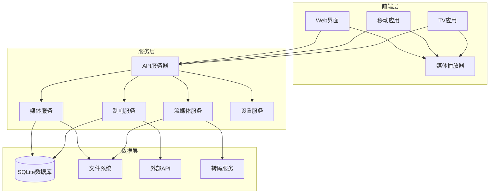

# 本地视频系统概要设计文档

## 1. 项目概述

### 1.1 项目背景

随着个人媒体库的增长，用户对本地视频管理系统的需求日益增加。本系统旨在为用户提供一个功能完整、性能优异的本地视频管理解决方案，支持媒体文件的自动识别、元数据刮削、流媒体播放等功能，满足个人及家庭观影需求。

### 1.2 设计目标

- **轻量高效**：单设备运行，资源占用少
- **隐私安全**：数据完全本地存储，无泄露风险
- **功能完善**：支持媒体识别、元数据刮削、流媒体播放
- **易维护**：Docker容器化部署，更新简单
- **跨平台**：支持多种设备访问

### 1.3 核心功能

- 媒体库管理：自动扫描、识别、分类
- 元数据刮削：自动获取电影/剧集信息、封面
- 流媒体服务：支持实时转码、广告插入（可选）
- 多设备访问：支持Web、移动设备、智能电视
- 播放控制：支持字幕、播放历史、收藏

## 2. 架构设计

### 2.1 整体架构



### 2.2 架构特点

- **微服务架构**：各服务独立运行，易于扩展和维护
- **模块化设计**：功能模块清晰分离，便于单独升级
- **本地优先**：所有数据存储在本地，无外部依赖
- **实时处理**：支持实时转码和流媒体播放

## 3. 技术选型

### 3.1 核心技术栈

| 类别 | 技术 | 版本 | 选型理由 |
|------|------|------|----------|
| **前端** | Vue 3 + TypeScript | 3.x | 轻量、学习曲线平缓、生态丰富 |
| **UI组件** | Element Plus | 2.x | 中文友好、组件丰富、文档完善 |
| **后端** | Go + Gin | 1.20+ | 性能优异、编译型语言、生态成熟 |
| **数据库** | SQLite | 3.x | 零配置、轻量级、嵌入式 |
| **流媒体** | FFmpeg + Nginx | 5.x+ | 强大的转码能力、稳定的流媒体服务 |
| **容器化** | Docker | 20.x+ | 易于部署、环境隔离、版本管理 |
| **刮削** | Go + TMDB API | - | 高性能、跨平台、API集成方便 |
| **播放器** | DPlayer | 1.x | 开源、功能丰富、支持多种格式 |

### 3.2 外部依赖

| 依赖 | 用途 | 版本 |
|------|------|------|
| TMDB API | 电影/剧集元数据 | v3 |
| FFmpeg | 视频转码 | 5.0+ |
| Nginx | 流媒体服务 | 1.20+ |
| SQLite | 本地数据库 | 3.40+ |
| Go | 后端开发 | 1.20+ |
| Node.js | 前端开发 | 18.x |

## 4. 核心组件设计

### 4.1 前端系统

#### 4.1.1 页面结构

| 页面 | 功能 | 组件 |
|------|------|------|
| 首页 | 媒体推荐、最近添加、分类导航 | Carousel、MediaCard、CategoryNav |
| 媒体库 | 媒体列表、筛选、排序 | MediaGrid、FilterBar、SortOptions |
| 详情页 | 媒体信息、播放按钮、相关推荐 | InfoPanel、PlayButton、RelatedMedia |
| 播放页 | 视频播放器、字幕选择、播放控制 | DPlayer、SubtitleSelector、PlaybackControls |
| 设置页 | 媒体库配置、刮削器设置、系统信息 | SettingsPanel、LibraryConfig、SystemInfo |

#### 4.1.2 前端技术实现

- **状态管理**：Pinia
- **路由**：Vue Router
- **网络请求**：Axios
- **样式**：SCSS + Element Plus主题
- **响应式**：媒体查询 + Flex布局
- **构建工具**：Vite

### 4.2 后端系统

#### 4.2.1 API服务器

| API路径 | 方法 | 功能 | 模块 |
|---------|------|------|------|
| `/api/media` | GET | 获取媒体列表 | MediaService |
| `/api/media/:id` | GET | 获取媒体详情 | MediaService |
| `/api/media/:id/play` | GET | 获取播放地址 | StreamService |
| `/api/media/:id/subtitles` | GET | 获取字幕列表 | MediaService |
| `/api/folders` | GET | 获取文件夹列表 | MediaService |
| `/api/scan` | POST | 触发媒体扫描 | ScraperService |
| `/api/settings` | GET | 获取系统设置 | SettingService |
| `/api/settings` | PUT | 更新系统设置 | SettingService |
| `/api/history` | GET | 获取观看历史 | MediaService |
| `/api/history` | POST | 记录观看历史 | MediaService |
| `/api/favorites` | GET | 获取收藏列表 | MediaService |
| `/api/favorites` | POST | 添加/删除收藏 | MediaService |
| `/api/ws` | WS | 实时通知 | APIServer |

#### 4.2.2 媒体服务

- **功能**：媒体文件管理、元数据存储、播放控制
- **实现**：Go语言实现，使用SQLite存储元数据
- **核心算法**：
  - 媒体文件识别算法
  - 路径分析与分类
  - 播放历史管理

#### 4.2.3 刮削服务

- **功能**：元数据获取、封面下载、信息匹配
- **实现**：Go语言实现，调用TMDB API
- **核心算法**：
  - 文件名解析
  - 哈希匹配
  - 元数据合并

#### 4.2.4 流媒体服务

- **功能**：实时转码、流媒体分发、广告插入
- **实现**：FFmpeg + Nginx
- **核心算法**：
  - 实时转码策略
  - 自适应码率
  - 广告插入逻辑

### 4.3 数据模型

#### 4.3.1 数据库表结构

**`media`表**
| 字段名 | 数据类型 | 约束 | 描述 |
|--------|----------|------|------|
| `id` | INTEGER | PRIMARY KEY | 媒体ID |
| `type` | TEXT | NOT NULL | 媒体类型(movie/tv/anime) |
| `title` | TEXT | NOT NULL | 标题 |
| `original_title` | TEXT | | 原始标题 |
| `year` | INTEGER | | 年份 |
| `path` | TEXT | UNIQUE NOT NULL | 文件路径 |
| `poster_path` | TEXT | | 海报路径 |
| `backdrop_path` | TEXT | | 背景图路径 |
| `overview` | TEXT | | 简介 |
| `rating` | REAL | | 评分 |
| `runtime` | INTEGER | | 时长(分钟) |
| `created_at` | TIMESTAMP | DEFAULT CURRENT_TIMESTAMP | 创建时间 |
| `updated_at` | TIMESTAMP | DEFAULT CURRENT_TIMESTAMP | 更新时间 |

**`episodes`表**
| 字段名 | 数据类型 | 约束 | 描述 |
|--------|----------|------|------|
| `id` | INTEGER | PRIMARY KEY | 剧集ID |
| `series_id` | INTEGER | REFERENCES media(id) | 系列ID |
| `season_number` | INTEGER | | 季数 |
| `episode_number` | INTEGER | | 集数 |
| `title` | TEXT | | 标题 |
| `path` | TEXT | UNIQUE NOT NULL | 文件路径 |
| `poster_path` | TEXT | | 海报路径 |
| `overview` | TEXT | | 简介 |
| `runtime` | INTEGER | | 时长(分钟) |

**`watch_history`表**
| 字段名 | 数据类型 | 约束 | 描述 |
|--------|----------|------|------|
| `id` | INTEGER | PRIMARY KEY | 历史ID |
| `media_id` | INTEGER | REFERENCES media(id) | 媒体ID |
| `episode_id` | INTEGER | REFERENCES episodes(id) | 剧集ID |
| `progress` | REAL | DEFAULT 0 | 观看进度(0-1) |
| `completed` | BOOLEAN | DEFAULT FALSE | 是否完成 |
| `last_watched` | TIMESTAMP | DEFAULT CURRENT_TIMESTAMP | 最后观看时间 |

**`favorites`表**
| 字段名 | 数据类型 | 约束 | 描述 |
|--------|----------|------|------|
| `id` | INTEGER | PRIMARY KEY | 收藏ID |
| `media_id` | INTEGER | REFERENCES media(id) | 媒体ID |
| `created_at` | TIMESTAMP | DEFAULT CURRENT_TIMESTAMP | 收藏时间 |

**`settings`表**
| 字段名 | 数据类型 | 约束 | 描述 |
|--------|----------|------|------|
| `key` | TEXT | PRIMARY KEY | 设置键 |
| `value` | TEXT | | 设置值 |

### 4.4 流媒体服务设计

#### 4.4.1 方案三：伪直播实现

**架构**：
- FFmpeg 实时转码
- Nginx 流媒体分发
- 广告插入模块

**流程**：
1. 用户请求播放
2. API服务器解析请求
3. 启动FFmpeg转码进程
4. 生成HLS/DASH流
5. 插入广告（可选）
6. Nginx分发流媒体
7. 播放器接收并播放

**配置**：
```nginx
# nginx.conf
http {
    server {
        listen 8080;
        
        location /hls {
            types {
                application/vnd.apple.mpegurl m3u8;
                video/mp2t ts;
            }
            root /tmp/hls;
            add_header Cache-Control no-cache;
        }
    }
}
```

**转码命令**：
```bash
ffmpeg -i input.mp4 -profile:v baseline -level 3.0 -s 640x360 -start_number 0 -hls_time 10 -hls_list_size 0 -f hls /tmp/hls/playlist.m3u8
```

## 5. 部署方案

### 5.1 Docker 部署

#### 5.1.1 Docker Compose 配置

```yaml
# docker-compose.yml
version: '3.8'

services:
  media-server:
    build: .
    container_name: media-server
    ports:
      - "8080:8080"  # API服务
      - "3000:3000"  # 前端服务
      - "8090:8090"  # 流媒体服务
    volumes:
      - ./config:/app/config
      - ./data:/app/data
      - /path/to/media:/app/media
      - /path/to/cache:/app/cache
    environment:
      - TZ=Asia/Shanghai
      - API_PORT=8080
      - WEB_PORT=3000
      - STREAM_PORT=8090
    restart: unless-stopped

  nginx:
    image: nginx:latest
    container_name: nginx-stream
    ports:
      - "8090:8090"
    volumes:
      - ./nginx.conf:/etc/nginx/nginx.conf
      - /tmp/hls:/tmp/hls
    depends_on:
      - media-server
    restart: unless-stopped
```

#### 5.1.2 Dockerfile

```dockerfile
# Dockerfile
FROM golang:1.20-alpine AS backend-builder

WORKDIR /app/backend
COPY backend/go.mod backend/go.sum ./
RUN go mod download
COPY backend/ .
RUN go build -o media-server .

FROM node:18-alpine AS frontend-builder

WORKDIR /app/frontend
COPY frontend/package*.json ./
RUN npm install
COPY frontend/ .
RUN npm run build

FROM alpine:latest

RUN apk add --no-cache ffmpeg nginx sqlite3

WORKDIR /app
COPY --from=backend-builder /app/backend/media-server ./backend/
COPY --from=frontend-builder /app/frontend/dist ./frontend/

COPY docker/nginx.conf /etc/nginx/nginx.conf
COPY docker/start.sh /app/start.sh

RUN chmod +x /app/start.sh

VOLUME ["/app/config", "/app/data", "/app/media", "/app/cache"]

EXPOSE 8080 3000 8090

CMD ["/app/start.sh"]
```

### 5.2 部署流程

1. **准备环境**：
   - 安装Docker和Docker Compose
   - 准备媒体存储目录

2. **配置文件**：
   - 创建 `docker-compose.yml`
   - 配置媒体路径
   - 调整端口映射

3. **构建镜像**：
   ```bash
   docker-compose build
   ```

4. **启动服务**：
   ```bash
   docker-compose up -d
   ```

5. **访问系统**：
   - Web界面：http://localhost:3000
   - API文档：http://localhost:8080/api/docs

## 6. 安全策略

### 6.1 本地安全措施

1. **访问控制**：
   - 局域网访问限制
   - 可选的密码保护
   - 家长控制功能

2. **数据保护**：
   - 定期备份数据库
   - 媒体文件冗余存储
   - 配置文件备份

3. **隐私保护**：
   - 无公网数据传输
   - 本地元数据处理
   - 无用户数据收集

4. **远程访问**（可选）：
   - VPN连接
   - HTTPS加密
   - 端口转发安全

### 6.2 安全配置

**Nginx 安全配置**：
```nginx
# nginx.conf 安全配置
server {
    # 禁用服务器签名
    server_tokens off;
    
    # 限制请求方法
    if ($request_method !~ ^(GET|POST|HEAD)$) {
        return 405;
    }
    
    # 防止XSS
    add_header X-Content-Type-Options nosniff;
    add_header X-Frame-Options SAMEORIGIN;
    add_header X-XSS-Protection "1; mode=block";
}
```

**API 安全配置**：
- 速率限制
- 输入验证
- 错误处理

## 7. 开发计划

### 7.1 项目结构

```
media-system/
├── backend/                # 后端代码
│   ├── cmd/
│   │   └── main.go        # 主入口
│   ├── internal/
│   │   ├── api/           # API路由
│   │   ├── service/       # 业务逻辑
│   │   ├── model/         # 数据模型
│   │   └── config/        # 配置管理
│   ├── pkg/               # 公共包
│   ├── go.mod
│   └── go.sum
├── frontend/               # 前端代码
│   ├── public/            # 静态资源
│   ├── src/               # 源代码
│   │   ├── components/    # 组件
│   │   ├── views/         # 页面
│   │   ├── services/      # API服务
│   │   ├── store/         # 状态管理
│   │   └── router/        # 路由
│   ├── package.json
│   └── vite.config.ts
├── docker/                # Docker配置
│   ├── Dockerfile
│   ├── docker-compose.yml
│   ├── nginx.conf
│   └── start.sh
└── README.md              # 项目说明
```

### 7.2 开发阶段

#### 阶段一：基础架构搭建（2周）
- 项目初始化
- 目录结构创建
- Docker配置
- 基础API框架

#### 阶段二：媒体管理功能（3周）
- 媒体扫描模块
- 元数据存储
- 数据库设计
- 基础API实现

#### 阶段三：刮削服务（2周）
- TMDB API集成
- 元数据刮削
- 封面下载
- 信息匹配

#### 阶段四：流媒体服务（2周）
- FFmpeg集成
- Nginx配置
- 实时转码
- 广告插入

#### 阶段五：前端开发（3周）
- 页面设计
- 组件开发
- API集成
- 播放器集成

#### 阶段六：测试与优化（2周）
- 功能测试
- 性能优化
- 安全测试
- 文档完善

### 7.3 关键里程碑

| 里程碑 | 完成标准 |
|--------|----------|
| 基础架构完成 | 项目可运行，API框架搭建完成 |
| 媒体管理功能 | 可扫描、存储媒体信息 |
| 刮削服务 | 可自动获取元数据和封面 |
| 流媒体服务 | 可实现实时转码和播放 |
| 前端界面 | 可通过Web访问系统 |
| 系统上线 | 所有功能测试通过，文档完善 |

## 8. 性能优化

### 8.1 数据库优化
- SQLite索引优化
- 批量操作
- 缓存策略

### 8.2 存储优化
- 图片压缩
- 元数据缓存
- 增量扫描

### 8.3 转码优化
- 硬件加速
- 智能码率
- 预缓存

### 8.4 网络优化
- 局域网优化
- 多线程下载
- CDN加速（可选）

## 9. 扩展性设计

### 9.1 功能扩展
- 支持更多媒体格式
- 集成更多刮削源
- 添加用户系统
- 支持远程访问

### 9.2 硬件扩展
- 支持多存储设备
- 支持GPU加速
- 支持集群部署

### 9.3 集成扩展
- 与智能家居集成
- 与语音助手集成
- 与其他媒体系统集成

## 10. 结论

本概要设计文档提供了一个完整的本地视频系统架构设计，采用自建方案，选择伪直播作为流媒体服务，使用Docker部署。该设计充分考虑了本地部署的特点，具有轻量、高效、安全等优势，能够满足个人及家庭观影需求。

通过分阶段开发计划，项目可以有序推进，最终实现一个功能完整、性能优异的本地视频管理系统。系统的模块化设计和扩展性考虑，也为后续功能扩展和硬件升级提供了良好的基础。